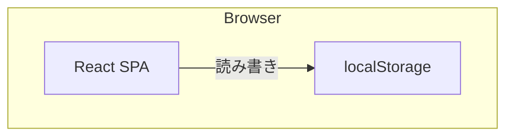

# Architecture

## システム概要図



サーバーレス構成。全てブラウザ内で完結する。

## 技術スタック

| レイヤー | 技術 | 選定理由 |
|---------|------|---------|
| フロントエンド | React + Vite | 軽量で高速。SPA構築に最適 |
| スタイリング | Tailwind CSS | ユーティリティファーストで素早くUI構築 |
| データ永続化 | localStorage | サーバー不要。個人利用に十分 |
| パッケージマネージャー | Bun | npm互換で高速。ランタイムとしても使用 |
| テスト | Bun test | Bun組み込みのテストランナー。Jest互換 |
| デプロイ | 静的ホスティング | Viteビルド出力をそのままホスティング |

## ディレクトリ構成

```
simple-tasks/
├── bun.lock
├── package.json
├── index.html
├── vite.config.ts
├── tsconfig.json
├── public/
├── src/
│   ├── main.tsx
│   ├── App.tsx
│   ├── components/
│   │   ├── TaskInput.tsx
│   │   ├── TaskList.tsx
│   │   ├── TaskItem.tsx
│   │   └── CompletedList.tsx
│   ├── hooks/
│   │   └── useTasks.ts
│   ├── types/
│   │   └── task.ts
│   └── lib/
│       └── storage.ts
└── tests/
    ├── useTasks.test.ts
    └── storage.test.ts
```

## 技術的な意思決定

### 決定1: フレームワーク不使用（React + Vite のみ）

- **選択肢A:** Next.js（フルスタックフレームワーク）
- **選択肢B:** React + Vite（SPA）
- **決定:** 選択肢B。理由: サーバーサイド機能が不要。localStorage のみで完結するため、最もシンプルな構成を選択

### 決定2: Bun をパッケージマネージャー・テストランナーとして採用

- **選択肢A:** npm + Vitest
- **選択肢B:** Bun（パッケージマネージャー + テストランナー統合）
- **決定:** 選択肢B。理由: ツールチェーンを統一でき、セットアップがシンプル。速度も高速
