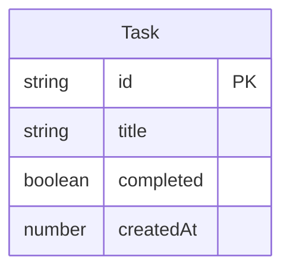

# Data Model

## エンティティ一覧

| エンティティ | 説明 | 主なリレーション |
|-------------|------|-----------------|
| Task | ユーザーが管理するタスク | なし（単独エンティティ） |

## エンティティ詳細

### Task

| 属性名 | 型 | 必須 | 説明 |
|--------|-----|------|------|
| id | string | Yes | 一意識別子（UUID） |
| title | string | Yes | タスクのタイトル |
| completed | boolean | Yes | 完了状態（false: 未完了, true: 完了） |
| createdAt | number | Yes | 作成日時（Unix timestamp） |

## ER図



エンティティは Task 1つのみ。リレーションなし。

## ストレージ設計

- localStorage のキー: `simple-tasks`
- 保存形式: `Task[]` をJSON文字列化して保存
- 操作: 追加・完了トグル・削除のたびに全件を書き込む

```json
[
  {
    "id": "550e8400-e29b-41d4-a716-446655440000",
    "title": "牛乳を買う",
    "completed": false,
    "createdAt": 1740400000000
  }
]
```
