# Team Plan

## チーム構成

| メンバー | 担当領域 | 備考 |
|---------|---------|------|
| メンバーA | タスク一覧画面（`/`）: US-001, US-002, US-003, US-004, US-006 | メイン画面 + 共通基盤 |
| メンバーB | 完了済み画面（`/completed`）: US-005, US-006 | 完了済み画面 + ルーティング |

## 並列ストリーム設計

| ストリーム | 担当 | 内容 | 依存関係 |
|-----------|------|------|---------|
| Stream 1 | メンバーA | Task型定義, storage.ts, useTasks hook, TaskInput, TaskList, TaskItem | なし（先行して開始可能） |
| Stream 2 | メンバーB | React Router設定, CompletedPage, 戻るナビゲーション, テスト | Stream 1 の型定義・hook・storage に依存 |

## タスク分割方針

- 分割の軸: ページ単位（2ページ構成を活用）
- 各ストリームの独立性: Stream 1 が共通基盤（型・hook・storage）+ メイン画面を先行提供、Stream 2 は完了済みページ + ルーティングを実装
- 統合ポイント: React Router のルート定義で両ページを結合する時点
- 共通基盤（型定義・hook・storage）はメンバーAが先行して作り、メンバーBに提供する

## タイムライン概要

```mermaid
gantt
    title 開発タイムライン
    dateFormat  HH:mm
    axisFormat  %H:%M

    section Stream 1（メンバーA: タスク一覧画面）
    型定義 + storage.ts      :a1, 00:00, 15m
    useTasks hook            :a2, after a1, 15m
    TaskInput + TaskList     :a3, after a2, 20m
    TaskItem（完了+削除）     :a4, after a3, 15m

    section Stream 2（メンバーB: 完了済み画面）
    React Router設定          :b1, after a2, 10m
    CompletedPage            :b2, after b1, 20m
    ナビゲーション導線        :b3, after b2, 10m
    テスト                   :b4, after b3, 15m

    section 統合
    ルート統合 + 動作確認     :c1, after a4, 15m
```

