# Team Plan

## チーム構成

| メンバー | 担当領域 | 備考 |
|---------|---------|------|
| メンバーA | US-001（タスク追加）、US-002（一覧表示）、US-006（永続化） | 基盤+入力系 |
| メンバーB | US-003（タスク完了）、US-004（削除）、US-005（完了済み一覧） | 操作+表示系 |

## 並列ストリーム設計

| ストリーム | 担当 | 内容 | 依存関係 |
|-----------|------|------|---------|
| Stream 1 | メンバーA | Task型定義, storage.ts, useTasks hook, TaskInput, TaskList, テスト | なし（先行して開始可能） |
| Stream 2 | メンバーB | TaskItem（完了トグル+削除）, CompletedList, テスト | Stream 1 の型定義・hook・storage に依存 |

## タスク分割方針

- 分割の軸: ユーザーストーリー単位
- 各ストリームの独立性: Stream 1 が基盤（型・hook・storage）を先に提供し、Stream 2 はそれを利用して操作系を実装
- 統合ポイント: App.tsx で全コンポーネントを組み合わせる時点
- 共通基盤（型定義・hook・storage）はメンバーAが先行して作り、メンバーBに提供する

## タイムライン概要

```mermaid
gantt
    title 開発タイムライン
    dateFormat  HH:mm
    axisFormat  %H:%M

    section Stream 1（メンバーA: 基盤+入力系）
    型定義 + storage.ts      :a1, 00:00, 15m
    useTasks hook            :a2, after a1, 15m
    TaskInput + TaskList     :a3, after a2, 20m
    テスト                   :a4, after a3, 15m

    section Stream 2（メンバーB: 操作+表示系）
    TaskItem（完了+削除）     :b1, after a2, 20m
    CompletedList            :b2, after b1, 15m
    テスト                   :b3, after b2, 15m

    section 統合
    App.tsx 統合              :c1, after a3, 15m
```

