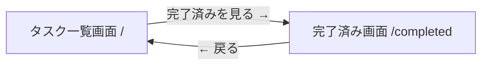

# UI Design

## 画面一覧

| # | 画面名 | URL | 概要 | 対応ユーザーストーリー |
|---|--------|-----|------|---------------------|
| 1 | タスク一覧画面 | `/` | タスク入力 + 未完了タスク一覧 | US-001, US-002, US-003, US-004, US-006 |
| 2 | 完了済み画面 | `/completed` | 完了済みタスクの一覧 | US-005, US-006 |

2ページ構成。未完了タスクの操作と完了済みタスクの確認を分離する。

## 画面遷移フロー



## 画面詳細

### 画面1: タスク一覧画面（`/`）

**概要:** アプリのメイン画面。タスクの追加・一覧表示・完了・削除を行う
**ユーザーストーリー:** US-001, US-002, US-003, US-004, US-006

**レイアウト:**

```
+------------------------------------------+
|            Simple Tasks                   |
+------------------------------------------+
|                                           |
|  +-----------------------------+ +------+ |
|  | タスクを入力...               | | 追加 | |
|  +-----------------------------+ +------+ |
|                                           |
|  □ 買い物に行く                    [×]   |
|  □ レポートを書く                  [×]   |
|  □ メール返信                      [×]   |
|                                           |
+------------------------------------------+
|  完了済みを見る →                         |
+------------------------------------------+
```

**主要な要素:**
- ヘッダー: アプリ名「Simple Tasks」
- 入力エリア: テキストフィールド + 追加ボタン
- 未完了タスクリスト: チェックボックス + タスク名 + 削除ボタン(×)
- フッターリンク: 完了済み画面への導線

**インタラクション:**
- テキスト入力 → Enter or 追加ボタン → タスク追加（一覧に即反映）
- チェックボックスクリック → タスクを完了にする（一覧から消える）
- × クリック → タスクを削除
- 「完了済みを見る →」クリック → 完了済み画面に遷移
- 空テキストでは追加ボタン無効

---

### 画面2: 完了済み画面（`/completed`）

**概要:** 完了したタスクの一覧を確認する画面
**ユーザーストーリー:** US-005, US-006

**レイアウト:**

```
+------------------------------------------+
|  ← 戻る    完了済みタスク                  |
+------------------------------------------+
|                                           |
|  ✓ 洗濯をする                      [×]   |
|  ✓ 部屋を掃除する                  [×]   |
|                                           |
+------------------------------------------+
```

**主要な要素:**
- ヘッダー: 戻るリンク + 画面タイトル「完了済みタスク」
- 完了済みタスクリスト: チェック済みマーク + タスク名 + 削除ボタン(×)

**インタラクション:**
- 「← 戻る」クリック → タスク一覧画面に遷移
- チェック済みマーククリック → 未完了に戻す（一覧画面に移動する）
- × クリック → タスクを削除
