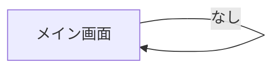

# UI/UX Design

## 画面一覧

| # | 画面名 | 概要 | 対応ユーザーストーリー |
|---|--------|------|---------------------|
| 1 | メイン画面 | タスク入力 + 未完了一覧 + 完了済み一覧 | US-001〜US-006 |

1画面のみ。シンプルさを最優先し、画面遷移なしで全機能を提供する。

## 画面遷移フロー



画面遷移は存在しない。全てが1画面内で完結する。

## 画面詳細

### メイン画面

**概要:** アプリの唯一の画面。タスクの追加・一覧・完了・削除を行う
**ユーザーストーリー:** US-001〜US-006

**レイアウト:**

```
┌─────────────────────────────────┐
│        Simple Tasks             │
├─────────────────────────────────┤
│                                 │
│  ┌───────────────────┐ ┌─────┐ │
│  │ タスクを入力...     │ │ 追加 │ │
│  └───────────────────┘ └─────┘ │
│                                 │
│  ── 未完了（3件）──────────────  │
│                                 │
│  ☐ 牛乳を買う              🗑  │
│  ☐ レポートを書く           🗑  │
│  ☐ メールを返す             🗑  │
│                                 │
│  ── 完了済み（2件）────────────  │
│                                 │
│  ☑ 部屋を掃除する          🗑  │
│  ☑ 本を返す                🗑  │
│                                 │
└─────────────────────────────────┘
```

**主要な要素:**

- タイトル「Simple Tasks」
- テキスト入力欄 + 追加ボタン
- 未完了タスク一覧（チェックボックス + タスク名 + 削除ボタン）
- 完了済みタスク一覧（折りたたみ可能）

**インタラクション:**

- テキスト入力 → Enter or 追加ボタン → タスク追加
- チェックボックスクリック → 完了/未完了の切り替え
- 🗑 クリック → タスク削除
- 完了済みセクションのヘッダークリック → 折りたたみ/展開
