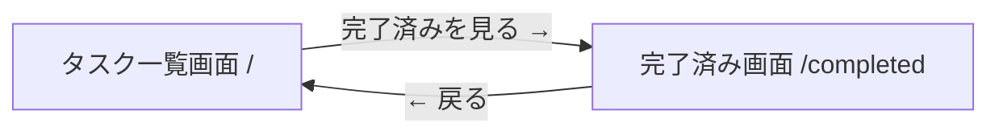

# Prototype Design

## プロトタイプのゴール

- [ ] 2ページ間の画面遷移（導線）が自然に機能する
- [ ] タスクの追加・完了・削除の基本フローが動作する
- [ ] 完了済み画面で完了タスクの確認・未完了への戻しができる
- [ ] localStorage によるデータ永続化が動作する
- [ ] UI設計（画面構成・コンポーネント配置・表示要素）が確定する

## エンティティ（最小限）

| エンティティ | 主要な属性 |
|-------------|-----------|
| Task | id, title, completed |

createdAt はプロトタイプでは省略。

## ユースケース（主要フロー）

### UC-1: タスクを追加する

1. タスク一覧画面（`/`）でテキスト入力欄にタスク名を入力
2. Enter キーまたは追加ボタンをクリック
3. タスクが未完了一覧に表示される

### UC-2: タスクを完了にする

1. タスク一覧画面（`/`）でタスクのチェックボックスをクリック
2. タスクが未完了一覧から消える

### UC-3: タスクを削除する

1. いずれかの画面でタスクの × ボタンをクリック
2. タスクが一覧から消える

### UC-4: 完了済みタスクを確認する

1. タスク一覧画面（`/`）で「完了済みを見る →」をクリック
2. 完了済み画面（`/completed`）に遷移
3. 完了済みタスクの一覧が表示される
4. 「← 戻る」でタスク一覧画面に戻れる

### UC-5: 完了済みタスクを未完了に戻す

1. 完了済み画面（`/completed`）でチェック済みマークをクリック
2. タスクが未完了に戻る（タスク一覧画面で確認可能）

---

## UI設計

### 画面一覧

| # | 画面名 | URL | 概要 | 主要コンポーネント |
|---|--------|-----|------|--------------------|
| 1 | タスク一覧画面 | `/` | タスク入力 + 未完了タスク一覧 | TaskInput, TaskList, TaskItem, フッターリンク |
| 2 | 完了済み画面 | `/completed` | 完了済みタスクの一覧 | ヘッダー（戻るリンク）, CompletedList, TaskItem |

### 画面遷移フロー



### 各画面のレイアウト

#### 画面1: タスク一覧画面（`/`）

```
+------------------------------------------+
|            Simple Tasks                   |
+------------------------------------------+
|                                           |
|  +-----------------------------+ +------+ |
|  | タスクを入力...               | | 追加 | |
|  +-----------------------------+ +------+ |
|                                           |
|  □ 買い物に行く                    [×]   |
|  □ レポートを書く                  [×]   |
|  □ メール返信                      [×]   |
|                                           |
+------------------------------------------+
|  完了済みを見る →                         |
+------------------------------------------+
```

**構成要素:**
- ヘッダー: アプリ名「Simple Tasks」
- TaskInput: テキストフィールド + 追加ボタン
- TaskList: 未完了タスクの一覧
- TaskItem: チェックボックス + タスク名 + 削除ボタン(×)
- フッター: 完了済み画面への導線リンク

**表示データ:**
- 未完了タスク（`completed === false`）のみ表示

#### 画面2: 完了済み画面（`/completed`）

```
+------------------------------------------+
|  ← 戻る    完了済みタスク                  |
+------------------------------------------+
|                                           |
|  ✓ 洗濯をする                      [×]   |
|  ✓ 部屋を掃除する                  [×]   |
|                                           |
+------------------------------------------+
```

**構成要素:**
- ヘッダー: 戻るリンク（`← 戻る`）+ 画面タイトル「完了済みタスク」
- CompletedList: 完了済みタスクの一覧
- TaskItem: チェック済みマーク + タスク名 + 削除ボタン(×)

**表示データ:**
- 完了済みタスク（`completed === true`）のみ表示

---

## モックデータ

```json
[
  { "id": "1", "title": "牛乳を買う", "completed": false },
  { "id": "2", "title": "レポートを書く", "completed": false },
  { "id": "3", "title": "メールを返す", "completed": false },
  { "id": "4", "title": "部屋を掃除する", "completed": true },
  { "id": "5", "title": "本を返す", "completed": true }
]
```

## 技術スタック（プロトタイプ用）

| レイヤー | 技術 |
|---------|------|
| フロントエンド | React + Vite |
| スタイリング | Tailwind CSS v4 |
| ルーティング | React Router |
| パッケージマネージャー | Bun |
| データ | localStorage |

## 対象外（プロトタイプでは作らない）

- テストコード
- エラーハンドリング
- 型の厳密な定義
- コンポーネントの細かい分割（必要最小限で可）

### UX（このフェーズでは対象外）

- マイクロインタラクション
- アニメーション・トランジション
- ローディング表現
- エラー表示の洗練
- レスポンシブ対応
