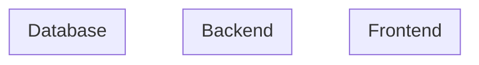

# Architecture

## システム概要図

<!-- テキストまたは Mermaid で全体構成を示す -->



## 技術スタック

| レイヤー | 技術 | 選定理由 |
|---------|------|---------|
| フロントエンド | | |
| バックエンド | | |
| データベース | | |
| インフラ | | |
| CI/CD | | |

## APIインターフェース概要

<!-- 主要なAPIエンドポイントの一覧 -->

| メソッド | パス | 説明 |
|---------|------|------|
|         |      |      |

## ディレクトリ構成

```
project/
├──
└──
```

## 技術的な意思決定

<!-- 重要な技術選定の背景・比較・決定理由 -->

### 決定1:

- **選択肢A:**
- **選択肢B:**
- **決定:** 選択肢X。理由:
